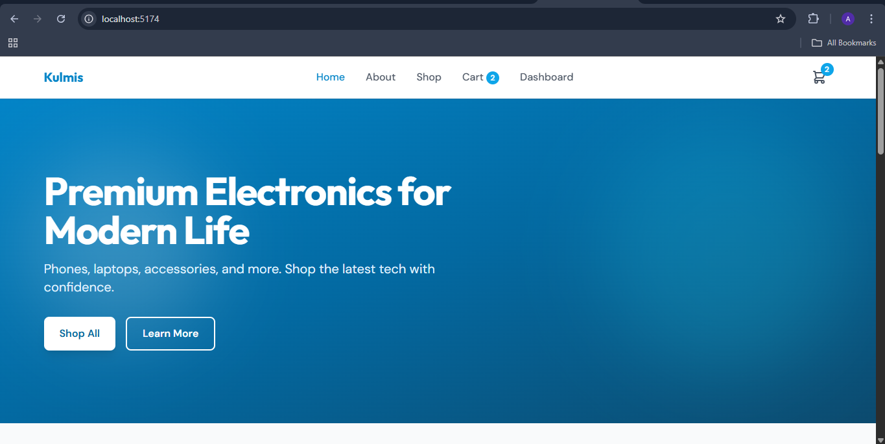
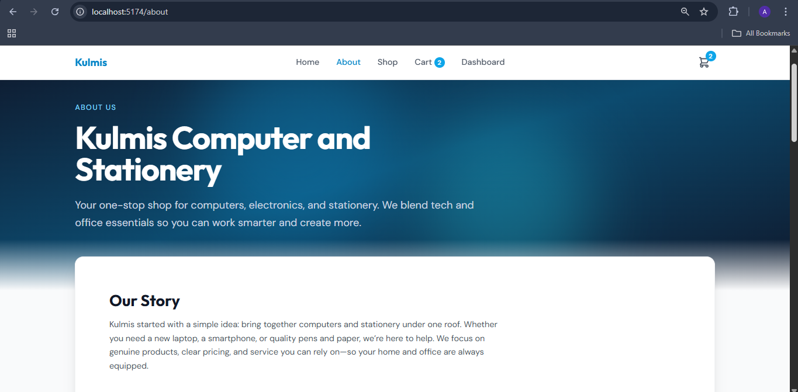
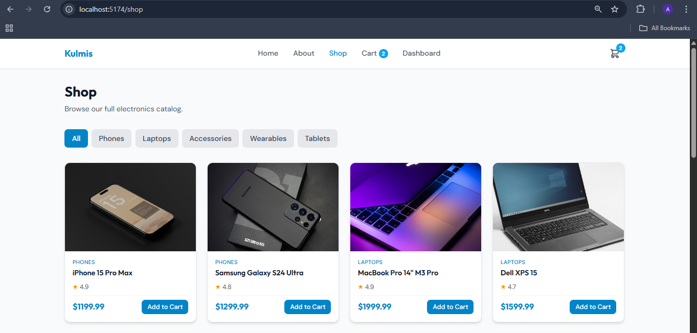
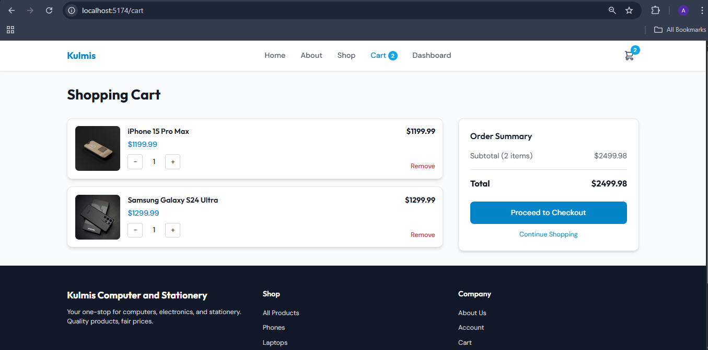
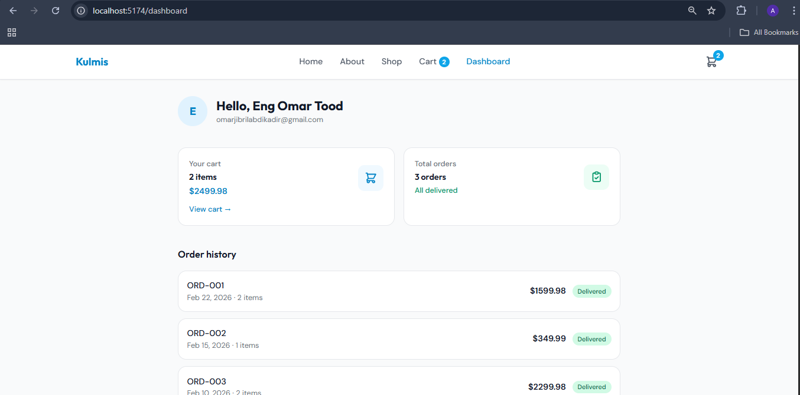

    ## React  Last
  
  ***
  
  ## Developer Name: Eng Abdirahman Ai
  
  ***
  
  ## Group A
  
  ***
  
  [GitHub Link](https://github.com/engai2025/React-Exercise-26)
  
  ***
  
  ## Code

    ### Dashboard.jsx
  
  ```jsx
import { Link } from 'react-router-dom';
import { useCart } from '../context/CartContext';

const personUser = {
  name: 'Eng Omar Tood',
  email: 'omarjibrilabdikadir@gmail.com',
};

const personUser = [
  { id: 'ORD-001', date: 'Feb 22, 2026', total: 1599.98, status: 'Delivered', items: 2 },
  { id: 'ORD-002', date: 'Feb 15, 2026', total: 349.99, status: 'Delivered', items: 1 },
  { id: 'ORD-003', date: 'Feb 10, 2026', total: 2299.98, status: 'Delivered', items: 2 },
];

export default function Dashboard() {
  const { items, cartTotal, cartCount } = useCart();

  return (
    <div className="max-w-4xl mx-auto px-4 sm:px-6 lg:px-8 py-8">
   
      <div className="flex items-center gap-4 mb-10">
        <div className="w-14 h-14 rounded-full bg-primary-100 text-primary-600 flex items-center justify-center font-display font-bold text-xl">
          {personUser.name.charAt(0)}
        </div>
        <div>
          <h1 className="font-display text-2xl font-bold text-gray-900">
            Hello, {personUser.name}
          </h1>
          <p className="text-gray-500 text-sm">{personUser.email}</p>
        </div>
      </div>

   
      <div className="grid sm:grid-cols-2 gap-4 mb-10">
        <Link
          to="/cart"
          className="block p-5 rounded-2xl bg-white border border-gray-200 hover:border-primary-200 hover:shadow-md transition-all duration-200"
        >
          <div className="flex items-center justify-between">
            <div>
              <p className="text-sm font-medium text-gray-500">Your cart</p>
              <p className="mt-1 font-display font-semibold text-gray-900">
                {cartCount} {cartCount === 1 ? 'item' : 'items'}
              </p>
              <p className="text-primary-600 font-semibold mt-0.5">
                ${cartTotal.toFixed(2)}
              </p>
            </div>
            <span className="w-12 h-12 rounded-xl bg-primary-50 text-primary-600 flex items-center justify-center">
              <svg className="w-6 h-6" fill="none" stroke="currentColor" viewBox="0 0 24 24">
                <path strokeLinecap="round" strokeLinejoin="round" strokeWidth={2} d="M3 3h2l.4 2M7 13h10l4-8H5.4M7 13L5.4 5M7 13l-2.293 2.293c-.63.63-.184 1.707.707 1.707H17m0 0a2 2 0 100 4 2 2 0 000-4zm-8 2a2 2 0 11-4 0 2 2 0 014 0z" />
              </svg>
            </span>
          </div>
          <p className="mt-3 text-sm text-primary-600 font-medium">View cart →</p>
        </Link>

        <div className="p-5 rounded-2xl bg-white border border-gray-200">
          <div className="flex items-center justify-between">
            <div>
              <p className="text-sm font-medium text-gray-500">Total orders</p>
              <p className="mt-1 font-display font-semibold text-gray-900">
                {ourOrders.length} orders
              </p>
              <p className="text-emerald-600 text-sm font-medium mt-0.5">All delivered</p>
            </div>
            <span className="w-12 h-12 rounded-xl bg-emerald-50 text-emerald-600 flex items-center justify-center">
              <svg className="w-6 h-6" fill="none" stroke="currentColor" viewBox="0 0 24 24">
                <path strokeLinecap="round" strokeLinejoin="round" strokeWidth={2} d="M9 5H7a2 2 0 00-2 2v12a2 2 0 002 2h10a2 2 0 002-2V7a2 2 0 00-2-2h-2M9 5a2 2 0 002 2h2a2 2 0 002-2M9 5a2 2 0 012-2h2a2 2 0 012 2m-6 9l2 2 4-4" />
              </svg>
            </span>
          </div>
        </div>
      </div>
 
      <section>
        <h2 className="font-display text-lg font-semibold text-gray-900 mb-4">
          Order history
        </h2>
        <div className="space-y-3">
          {ourOrders.map((order) => (
            <div
              key={order.id}
              className="flex flex-wrap items-center justify-between gap-3 p-4 rounded-2xl bg-white border border-gray-200 hover:border-gray-300 transition-colors"
            >
              <div className="flex-1 min-w-0">
                <p className="font-medium text-gray-900">{order.id}</p>
                <p className="text-sm text-gray-500">{order.date} · {order.items} items</p>
              </div>
              <div className="flex items-center gap-3">
                <span className="font-semibold text-gray-900">
                  ${order.total.toFixed(2)}
                </span>
                <span className="px-2.5 py-1 text-xs font-medium rounded-full bg-emerald-100 text-emerald-800">
                  {order.status}
                </span>
              </div>
            </div>
          ))}
        </div>
        <p className="mt-4 text-sm text-gray-400">
          Demo data. In a real app, orders would come from your account.
        </p>
      </section>

   
      <div className="mt-10 text-center">
        <Link
          to="/shop"
          className="inline-flex items-center gap-2 text-primary-600 font-medium hover:text-primary-700"
        >
          Continue shopping
          <svg className="w-4 h-4" fill="none" stroke="currentColor" viewBox="0 0 24 24">
            <path strokeLinecap="round" strokeLinejoin="round" strokeWidth={2} d="M17 8l4 4m0 0l-4 4m4-4H3" />
          </svg>
        </Link>
      </div>
    </div>
  );
}

  ```
  
  ### App.jsx
  
  ```jsx
  
 import { BrowserRouter, Routes, Route } from 'react-router-dom';
import { CartProvider } from './context/CartContext';
import Layout from './components/Layout';
import Home from './pages/Home';
import Shop from './pages/Shop';
import ProductDetails from './pages/ProductDetails';
import Cart from './pages/Cart';
import Dashboard from './pages/Dashboard';
import About from './pages/About';

export default function App() {
  return (
    <BrowserRouter>
      <CartProvider>
        <Routes>
          <Route path="/" element={<Layout />}>
            <Route index element={<Home />} />
            <Route path="shop" element={<Shop />} />
            <Route path="product/:id" element={<ProductDetails />} />
            <Route path="cart" element={<Cart />} />
            <Route path="dashboard" element={<Dashboard />} />
            <Route path="about" element={<About />} />
          </Route>
        </Routes>
      </CartProvider>
    </BrowserRouter>
  );
}

   ```

  ### footerLinksjsx
  
  ```jsx
  
import { Link } from 'react-router-dom';

const footerLinks = {
  Shop: [
    { to: '/shop', label: 'All Products' },
    { to: '/shop?category=Phones', label: 'Phones' },
    { to: '/shop?category=Laptops', label: 'Laptops' },
    { to: '/shop?category=Accessories', label: 'Accessories' },
  ],
  Company: [
    { to: '/about', label: 'About Us' },
    { to: '/dashboard', label: 'Account' },
    { to: '/cart', label: 'Cart' },
  ],
};

export default function Footer() {
  return (
    <footer className="bg-gray-900 text-gray-300 mt-auto">
      <div className="max-w-7xl mx-auto px-4 sm:px-6 lg:px-8 py-12">
        <div className="grid grid-cols-1 md:grid-cols-3 gap-8">
          <div>
            <Link to="/" className="font-display font-bold text-xl text-white">
              Kulmis Computer and Stationery
            </Link>
            <p className="mt-3 text-sm">
              Your one-stop for computers, electronics, and stationery. Quality products, fair prices.
            </p>
          </div>
          {Object.entries(footerLinks).map(([title, links]) => (
            <div key={title}>
              <h4 className="font-display font-semibold text-white mb-4">{title}</h4>
              <ul className="space-y-2">
                {links.map(({ to, label }) => (
                  <li key={to}>
                    <Link to={to} className="text-sm hover:text-white transition-colors">
                      {label}
                    </Link>
                  </li>
                ))}
              </ul>
            </div>
          ))}
        </div>
        <div className="mt-10 pt-8 border-t border-gray-800 text-center text-sm text-gray-500">
          © {new Date().getFullYear()} Kulmis Computer and Stationery. All rights reserved.
        </div>
      </div>
    </footer>
  );
}

  ```

    ### Navbar.jsx
  
  ```jsx

  import { useState } from 'react';
import { Link, NavLink } from 'react-router-dom';
import { useCart } from '../context/CartContext';

const navLinks = [
  { to: '/', label: 'Home' },
  { to: '/about', label: 'About' },
  { to: '/shop', label: 'Shop' },
  { to: '/cart', label: 'Cart' },
  { to: '/dashboard', label: 'Dashboard' },
];

export default function Navbar() {
  const [mobileMenuOpen, setMobileMenuOpen] = useState(false);
  const { cartCount } = useCart();

  return (
    <nav className="bg-white border-b border-gray-200 sticky top-0 z-50 shadow-sm">
      <div className="max-w-7xl mx-auto px-4 sm:px-6 lg:px-8">
        <div className="flex justify-between items-center h-16">
          <Link
            to="/"
            className="font-display font-bold text-xl text-primary-600 hover:text-primary-700 transition-colors"
          >
            Kulmis
          </Link>

          <div className="hidden md:flex items-center gap-8">
            {navLinks.map(({ to, label }) => (
              <NavLink
                key={to}
                to={to}
                className={({ isActive }) =>
                  `font-medium transition-colors ${
                    isActive
                      ? 'text-primary-600'
                      : 'text-gray-600 hover:text-primary-600'
                  }`
                }
              >
                {label}
                {to === '/cart' && cartCount > 0 && (
                  <span className="ml-1 inline-flex items-center justify-center min-w-[1.25rem] h-5 px-1.5 text-xs font-semibold text-white bg-primary-500 rounded-full">
                    {cartCount}
                  </span>
                )}
              </NavLink>
            ))}
          </div>

          <div className="flex items-center gap-4">
            <Link
              to="/cart"
              className="relative p-2 text-gray-600 hover:text-primary-600 transition-colors"
              aria-label="Cart"
            >
              <svg
                className="w-6 h-6"
                fill="none"
                stroke="currentColor"
                viewBox="0 0 24 24"
              >
                <path
                  strokeLinecap="round"
                  strokeLinejoin="round"
                  strokeWidth={2}
                  d="M3 3h2l.4 2M7 13h10l4-8H5.4M7 13L5.4 5M7 13l-2.293 2.293c-.63.63-.184 1.707.707 1.707H17m0 0a2 2 0 100 4 2 2 0 000-4zm-8 2a2 2 0 11-4 0 2 2 0 014 0z"
                />
              </svg>
              {cartCount > 0 && (
                <span className="absolute -top-0.5 -right-0.5 flex items-center justify-center w-5 h-5 text-xs font-semibold text-white bg-primary-500 rounded-full">
                  {cartCount}
                </span>
              )}
            </Link>

            <button
              type="button"
              className="md:hidden p-2 text-gray-600 hover:text-primary-600"
              onClick={() => setMobileMenuOpen((prev) => !prev)}
              aria-label="Toggle menu"
            >
              {mobileMenuOpen ? (
                <svg className="w-6 h-6" fill="none" stroke="currentColor" viewBox="0 0 24 24">
                  <path strokeLinecap="round" strokeLinejoin="round" strokeWidth={2} d="M6 18L18 6M6 6l12 12" />
                </svg>
              ) : (
                <svg className="w-6 h-6" fill="none" stroke="currentColor" viewBox="0 0 24 24">
                  <path strokeLinecap="round" strokeLinejoin="round" strokeWidth={2} d="M4 6h16M4 12h16M4 18h16" />
                </svg>
              )}
            </button>
          </div>
        </div>

        {mobileMenuOpen && (
          <div className="md:hidden py-4 border-t border-gray-200">
            <div className="flex flex-col gap-2">
              {navLinks.map(({ to, label }) => (
                <NavLink
                  key={to}
                  to={to}
                  onClick={() => setMobileMenuOpen(false)}
                  className={({ isActive }) =>
                    `block px-4 py-2 rounded-lg font-medium ${
                      isActive ? 'bg-primary-50 text-primary-600' : 'text-gray-600 hover:bg-gray-50'
                    }`
                  }
                >
                  {label}
                  {to === '/cart' && cartCount > 0 && ` (${cartCount})`}
                </NavLink>
              ))}
            </div>
          </div>
        )}
      </div>
    </nav>
  );
}

  ```

    ### Layout.jsx
  
  ```jsx
  import { Outlet } from 'react-router-dom';
import Navbar from './Navbar';
import Footer from './Footer';

export default function Layout() {
  return (
    <div className="min-h-screen flex flex-col">
      <Navbar />
      <main className="flex-1">
        <Outlet />
      </main>
      <Footer />
    </div>
  );
}

  ```

    ### ProductCart.jsx
  
  ```jsx
 import { useState } from 'react';
import { Link } from 'react-router-dom';
import { useCart } from '../context/CartContext';

const placeholderImage = 'data:image/svg+xml,' + encodeURIComponent(
  '<svg xmlns="http://www.w3.org/2000/svg" width="400" height="400" viewBox="0 0 400 400" fill="none"><rect width="400" height="400" fill="#e5e7eb"/><path d="M120 160h160v120H120z" fill="#9ca3af"/><path d="M140 280h120v20H140z" fill="#9ca3af"/><text x="200" y="220" font-family="sans-serif" font-size="14" fill="#6b7280" text-anchor="middle">No image</text></svg>'
);

export default function ProductCard({ product }) {
  const { addToCart } = useCart();
  const { id, name, category, price, image, rating } = product;
  const [imgError, setImgError] = useState(false);

  return (
    <article className="group bg-white rounded-xl border border-gray-200 overflow-hidden shadow-card hover:shadow-card-hover transition-all duration-300 flex flex-col">
      <Link to={`/product/${id}`} className="block overflow-hidden bg-gray-100 min-h-[12rem]">
         setImgError(true)}
        />
      </Link>
      <div className="p-4 flex flex-col flex-1">
        <p className="text-xs font-medium text-primary-600 uppercase tracking-wide mb-1">
          {category}
        </p>
        <Link to={`/product/${id}`} className="flex-1">
          <h3 className="font-display font-semibold text-gray-900 hover:text-primary-600 transition-colors line-clamp-2 mb-2">
            {name}
          </h3>
        </Link>
        <div className="flex items-center gap-1 text-amber-500 text-sm mb-2">
          <span aria-hidden>★</span>
          <span className="text-gray-600">{rating}</span>
        </div>
        <div className="flex items-center justify-between mt-auto pt-2 border-t border-gray-100">
          <p className="font-display font-bold text-lg text-primary-600">
            ${price.toFixed(2)}
          </p>
          <button
            type="button"
            onClick={() => addToCart(product)}
            className="btn-primary text-sm py-1.5 px-3"
          >
            Add to Cart
          </button>
        </div>
      </div>
    </article>
  );
}

  ```

    ### CartContext.jsx
  
  ```jsx
 import { createContext, useContext, useReducer, useEffect } from 'react';

const CartContext = createContext(null);

const CART_STORAGE_KEY = 'techhub_cart';

const cartReducer = (state, action) => {
  switch (action.type) {
    case 'ADD_ITEM': {
      const existing = state.items.find((item) => item.id === action.payload.id);
      if (existing) {
        return {
          ...state,
          items: state.items.map((item) =>
            item.id === action.payload.id
              ? { ...item, quantity: item.quantity + (action.payload.quantity || 1) }
              : item
          ),
        };
      }
      return {
        ...state,
        items: [...state.items, { ...action.payload, quantity: action.payload.quantity || 1 }],
      };
    }
    case 'REMOVE_ITEM':
      return {
        ...state,
        items: state.items.filter((item) => item.id !== action.payload),
      };
    case 'UPDATE_QUANTITY': {
      const { id, quantity } = action.payload;
      if (quantity <= 0) {
        return { ...state, items: state.items.filter((item) => item.id !== id) };
      }
      return {
        ...state,
        items: state.items.map((item) =>
          item.id === id ? { ...item, quantity } : item
        ),
      };
    }
    case 'CLEAR_CART':
      return { ...state, items: [] };
    case 'LOAD_CART':
      return { ...state, items: action.payload || [] };
    default:
      return state;
  }
};

const initialState = { items: [] };

export function CartProvider({ children }) {
  const [state, dispatch] = useReducer(cartReducer, initialState);

  useEffect(() => {
    try {
      const stored = localStorage.getItem(CART_STORAGE_KEY);
      if (stored) {
        const parsed = JSON.parse(stored);
        dispatch({ type: 'LOAD_CART', payload: parsed });
      }
    } catch (e) {
      console.warn('Failed to load cart from storage', e);
    }
  }, []);

  useEffect(() => {
    try {
      localStorage.setItem(CART_STORAGE_KEY, JSON.stringify(state.items));
    } catch (e) {
      console.warn('Failed to save cart to storage', e);
    }
  }, [state.items]);

  const addToCart = (product, quantity = 1) => {
    dispatch({
      type: 'ADD_ITEM',
      payload: {
        id: product.id,
        name: product.name,
        price: product.price,
        image: product.image,
        quantity,
      },
    });
  };

  const removeFromCart = (productId) => {
    dispatch({ type: 'REMOVE_ITEM', payload: productId });
  };

  const updateQuantity = (productId, quantity) => {
    dispatch({ type: 'UPDATE_QUANTITY', payload: { id: productId, quantity } });
  };

  const clearCart = () => {
    dispatch({ type: 'CLEAR_CART' });
  };

  const cartCount = state.items.reduce((sum, item) => sum + item.quantity, 0);
  const cartTotal = state.items.reduce((sum, item) => sum + item.price * item.quantity, 0);

  const value = {
    items: state.items,
    cartCount,
    cartTotal,
    addToCart,
    removeFromCart,
    updateQuantity,
    clearCart,
  };

  return <CartContext.Provider value={value}>{children}</CartContext.Provider>;
}

export function useCart() {
  const context = useContext(CartContext);
  if (!context) {
    throw new Error('useCart must be used within a CartProvider');
  }
  return context;
}

  ```
  ### CartContext.jsx
  
  ```jsx
  import { createContext, useContext, useReducer, useEffect } from 'react';

const CartContext = createContext(null);

const CART_STORAGE_KEY = 'techhub_cart';

const cartReducer = (state, action) => {
  switch (action.type) {
    case 'ADD_ITEM': {
      const existing = state.items.find((item) => item.id === action.payload.id);
      if (existing) {
        return {
          ...state,
          items: state.items.map((item) =>
            item.id === action.payload.id
              ? { ...item, quantity: item.quantity + (action.payload.quantity || 1) }
              : item
          ),
        };
      }
      return {
        ...state,
        items: [...state.items, { ...action.payload, quantity: action.payload.quantity || 1 }],
      };
    }
    case 'REMOVE_ITEM':
      return {
        ...state,
        items: state.items.filter((item) => item.id !== action.payload),
      };
    case 'UPDATE_QUANTITY': {
      const { id, quantity } = action.payload;
      if (quantity <= 0) {
        return { ...state, items: state.items.filter((item) => item.id !== id) };
      }
      return {
        ...state,
        items: state.items.map((item) =>
          item.id === id ? { ...item, quantity } : item
        ),
      };
    }
    case 'CLEAR_CART':
      return { ...state, items: [] };
    case 'LOAD_CART':
      return { ...state, items: action.payload || [] };
    default:
      return state;
  }
};

const initialState = { items: [] };

export function CartProvider({ children }) {
  const [state, dispatch] = useReducer(cartReducer, initialState);

  useEffect(() => {
    try {
      const stored = localStorage.getItem(CART_STORAGE_KEY);
      if (stored) {
        const parsed = JSON.parse(stored);
        dispatch({ type: 'LOAD_CART', payload: parsed });
      }
    } catch (e) {
      console.warn('Failed to load cart from storage', e);
    }
  }, []);

  useEffect(() => {
    try {
      localStorage.setItem(CART_STORAGE_KEY, JSON.stringify(state.items));
    } catch (e) {
      console.warn('Failed to save cart to storage', e);
    }
  }, [state.items]);

  const addToCart = (product, quantity = 1) => {
    dispatch({
      type: 'ADD_ITEM',
      payload: {
        id: product.id,
        name: product.name,
        price: product.price,
        image: product.image,
        quantity,
      },
    });
  };

  const removeFromCart = (productId) => {
    dispatch({ type: 'REMOVE_ITEM', payload: productId });
  };

  const updateQuantity = (productId, quantity) => {
    dispatch({ type: 'UPDATE_QUANTITY', payload: { id: productId, quantity } });
  };

  const clearCart = () => {
    dispatch({ type: 'CLEAR_CART' });
  };

  const cartCount = state.items.reduce((sum, item) => sum + item.quantity, 0);
  const cartTotal = state.items.reduce((sum, item) => sum + item.price * item.quantity, 0);

  const value = {
    items: state.items,
    cartCount,
    cartTotal,
    addToCart,
    removeFromCart,
    updateQuantity,
    clearCart,
  };

  return <CartContext.Provider value={value}>{children}</CartContext.Provider>;
}

export function useCart() {
  const context = useContext(CartContext);
  if (!context) {
    throw new Error('useCart must be used within a CartProvider');
  }
  return context;
}

  ```

    ### Product.js
  
  ```jsx
export const products = [
  {
    id: 1,
    name: "iPhone 15 Pro Max",
    category: "Phones",
    price: 1199.99,
    image: "https://images.unsplash.com/photo-1695048133142-1a20484d2569?w=400&h=400&fit=crop",
    description: "Titanium design. A17 Pro chip. Pro camera system with 5x optical zoom. Action button.",
    rating: 4.9,
    inStock: true,
  },
  {
    id: 2,
    name: "Samsung Galaxy S24 Ultra",
    category: "Phones",
    price: 1299.99,
    image: "https://images.unsplash.com/photo-1610945415295-d9bbf067e59c?w=400&h=400&fit=crop",
    description: "200MP camera, S Pen included, Galaxy AI. Stunning display and all-day battery.",
    rating: 4.8,
    inStock: true,
  },
  {
    id: 3,
    name: "MacBook Pro 14\" M3 Pro",
    category: "Laptops",
    price: 1999.99,
    image: "https://images.unsplash.com/photo-1517336714731-489689fd1ca8?w=400&h=400&fit=crop",
    description: "M3 Pro chip, 18GB unified memory, 14.2-inch Liquid Retina XDR display.",
    rating: 4.9,
    inStock: true,
  },
  {
    id: 4,
    name: "Dell XPS 15",
    category: "Laptops",
    price: 1599.99,
    image: "https://images.unsplash.com/photo-1588872657578-7efd1f1555ed?w=400&h=400&fit=crop",
    description: "Intel Core i7, 32GB RAM, 1TB SSD, 15.6\" 4K OLED InfinityEdge display.",
    rating: 4.7,
    inStock: true,
  },
  {
    id: 5,
    name: "Sony WH-1000XM5",
    category: "Accessories",
    price: 349.99,
    image: "https://images.unsplash.com/photo-1505740420928-5e560c06d30e?w=400&h=400&fit=crop",
    description: "Industry-leading noise canceling. 30-hour battery. Multipoint connection.",
    rating: 4.8,
    inStock: true,
  },
  {
    id: 6,
    name: "Apple Watch Ultra 2",
    category: "Wearables",
    price: 799.99,
    image: "https://images.unsplash.com/photo-1434493789847-2f02dc6ca35d?w=400&h=400&fit=crop",
    description: "49mm titanium case. Brightest display. Precision Dual-Frequency GPS.",
    rating: 4.8,
    inStock: true,
  },
  {
    id: 7,
    name: "iPad Pro 12.9\" M2",
    category: "Tablets",
    price: 1099.99,
    image: "https://images.unsplash.com/photo-1544244015-0df4b3ffc6b0?w=400&h=400&fit=crop",
    description: "M2 chip, 12.9-inch Liquid Retina XDR, ProMotion, Face ID.",
    rating: 4.9,
    inStock: true,
  },
  {
    id: 8,
    name: "Samsung 990 Pro 2TB SSD",
    category: "Accessories",
    price: 179.99,
    image: "https://images.unsplash.com/photo-1597872200969-2b65d56bd16b?w=400&h=400&fit=crop",
    description: "PCIe 4.0 NVMe. Up to 7,450 MB/s read. Heatsink included.",
    rating: 4.7,
    inStock: true,
  },
  {
    id: 9,
    name: "Logitech MX Master 3S",
    category: "Accessories",
    price: 99.99,
    image: "https://images.unsplash.com/photo-1527864550417-7fd91fc51a46?w=400&h=400&fit=crop",
    description: "Ultra-fast scrolling. Quiet clicks. 70-day battery. Ergonomic design.",
    rating: 4.8,
    inStock: true,
  },
  {
    id: 10,
    name: "Google Pixel 8 Pro",
    category: "Phones",
    price: 999.99,
    image: "https://images.unsplash.com/photo-1598327105666-5b89351aff97?w=400&h=400&fit=crop",
    description: "Tensor G3, best-in-class camera, 7 years of updates. Super Actua display.",
    rating: 4.7,
    inStock: true,
  },
  {
    id: 11,
    name: "Bose QuietComfort Earbuds II",
    category: "Accessories",
    price: 299.99,
    image: "https://images.unsplash.com/photo-1590658268037-6bf12165a8df?w=400&h=400&fit=crop",
    description: "CustomTune sound. World-class noise cancellation. 6-hour battery.",
    rating: 4.6,
    inStock: true,
  },
  {
    id: 12,
    name: "LG UltraWide 34\" Monitor",
    category: "Accessories",
    price: 549.99,
    image: "https://images.unsplash.com/photo-1527443224154-c4a3942d3acf?w=400&h=400&fit=crop",
    description: "34\" 21:9 QHD, 144Hz, 1ms, HDR10, USB-C. Ideal for work and play.",
    rating: 4.7,
    inStock: true,
  },
];

export const getProductById = (id) => products.find((p) => p.id === Number(id));
export const getProductsByCategory = (category) =>
  products.filter((p) => p.category === category);
export const getCategories = () =>
  [...new Set(products.map((p) => p.category))];

  ```

    ### About.jsx
  
  ```jsx
  import { Link } from 'react-router-dom';

const values = [
  {
    icon: (
      <svg className="w-8 h-8" fill="none" stroke="currentColor" viewBox="0 0 24 24">
        <path strokeLinecap="round" strokeLinejoin="round" strokeWidth={1.5} d="M9 12l2 2 4-4m5.618-4.016A11.955 11.955 0 0112 2.944a11.955 11.955 0 01-8.618 3.04A12.02 12.02 0 003 9c0 5.591 3.824 10.29 9 11.622 5.176-1.332 9-6.03 9-11.622 0-1.042-.133-2.052-.382-3.016z" />
      </svg>
    ),
    title: 'Authentic Products',
    description: 'Every device and stationery item is sourced from authorized distributors. No fakes, no compromises.',
  },
  {
    icon: (
      <svg className="w-8 h-8" fill="none" stroke="currentColor" viewBox="0 0 24 24">
        <path strokeLinecap="round" strokeLinejoin="round" strokeWidth={1.5} d="M12 8c-1.657 0-3 .895-3 2s1.343 2 3 2 3 .895 3 2-1.343 2-3 2m0-8c1.11 0 2.08.402 2.599 1M12 8V7m0 1v8m0 0v1m0-1c-1.11 0-2.08-.402-2.599-1M21 12a9 9 0 11-18 0 9 9 0 0118 0z" />
      </svg>
    ),
    title: 'Fair Pricing',
    description: 'Transparent prices with no hidden fees. We keep margins honest so you get the best value.',
  },
  {
    icon: (
      <svg className="w-8 h-8" fill="none" stroke="currentColor" viewBox="0 0 24 24">
        <path strokeLinecap="round" strokeLinejoin="round" strokeWidth={1.5} d="M5 8h14M5 8a2 2 0 110-4h14a2 2 0 110 4M5 8v10a2 2 0 002 2h10a2 2 0 002-2V8m-9 4h4" />
      </svg>
    ),
    title: 'Fast Delivery',
    description: 'Quick dispatch and reliable shipping. Get your computers and stationery when you need them.',
  },
  {
    icon: (
      <svg className="w-8 h-8" fill="none" stroke="currentColor" viewBox="0 0 24 24">
        <path strokeLinecap="round" strokeLinejoin="round" strokeWidth={1.5} d="M18.364 5.636l-3.536 3.536m0 5.656l3.536 3.536M9.172 9.172L5.636 5.636m3.536 9.192l-3.536 3.536M21 12a9 9 0 11-18 0 9 9 0 0118 0zm-9 7a7 7 0 100-14 7 7 0 000 14z" />
      </svg>
    ),
    title: 'Easy Returns',
    description: '30-day return policy. Not satisfied? Send it back—no hassle, no stress.',
  },
];

const stats = [
  { value: '10+', label: 'Years in business' },
  { value: '50K+', label: 'Happy customers' },
  { value: '500+', label: 'Products' },
  { value: '98%', label: 'Satisfaction rate' },
];

export default function About() {
  return (
    <div className="overflow-hidden">
 
      <section className="relative bg-gradient-to-br from-slate-900 via-primary-900 to-slate-900 text-white">
        <div className="absolute inset-0 opacity-30">
          <div className="absolute top-0 left-1/4 w-96 h-96 bg-primary-500 rounded-full blur-3xl" />
          <div className="absolute bottom-0 right-1/4 w-80 h-80 bg-cyan-400 rounded-full blur-3xl" />
        </div>
        <div className="relative max-w-7xl mx-auto px-4 sm:px-6 lg:px-8 py-20 md:py-28">
          <div className="max-w-3xl">
            <p className="text-primary-300 font-medium uppercase tracking-widest text-sm mb-4">
              About Us
            </p>
            <h1 className="font-display text-4xl md:text-5xl lg:text-6xl font-bold tracking-tight leading-tight">
              Kulmis Computer and Stationery
            </h1>
            <p className="mt-6 text-xl text-slate-300 leading-relaxed">
              Your one-stop shop for computers, electronics, and stationery. We blend tech and office essentials so you can work smarter and create more.
            </p>
          </div>
        </div>
        <div className="absolute bottom-0 left-0 right-0 h-24 bg-gradient-to-t from-gray-50 to-transparent" />
      </section>

 
      <section className="relative -mt-16 max-w-7xl mx-auto px-4 sm:px-6 lg:px-8">
        <div className="bg-white rounded-2xl shadow-xl border border-gray-100 p-8 md:p-12 lg:p-16">
          <h2 className="font-display text-2xl md:text-3xl font-bold text-gray-900">
            Our Story
          </h2>
          <p className="mt-4 text-gray-600 leading-relaxed max-w-3xl">
            Kulmis started with a simple idea: bring together computers and stationery under one roof. Whether you need a new laptop, a smartphone, or quality pens and paper, we’re here to help. We focus on genuine products, clear pricing, and service you can rely on—so your home and office are always equipped.
          </p>
        </div>
      </section>
 
      <section className="max-w-7xl mx-auto px-4 sm:px-6 lg:px-8 py-16 md:py-24">
        <div className="text-center mb-14">
          <h2 className="font-display text-3xl md:text-4xl font-bold text-gray-900">
            Why Choose Kulmis
          </h2>
          <p className="mt-3 text-gray-600 max-w-2xl mx-auto">
            We’re committed to quality, value, and a smooth experience from browse to delivery.
          </p>
        </div>
        <div className="grid sm:grid-cols-2 lg:grid-cols-4 gap-8">
          {values.map((item, i) => (
            <div
              key={i}
              className="group p-6 rounded-2xl bg-gray-50 border border-gray-100 hover:border-primary-200 hover:bg-primary-50/50 transition-all duration-300"
            >
              <div className="w-14 h-14 rounded-xl bg-primary-100 text-primary-600 flex items-center justify-center group-hover:bg-primary-200 group-hover:scale-105 transition-transform duration-300">
                {item.icon}
              </div>
              <h3 className="mt-4 font-display font-semibold text-gray-900 text-lg">
                {item.title}
              </h3>
              <p className="mt-2 text-gray-600 text-sm leading-relaxed">
                {item.description}
              </p>
            </div>
          ))}
        </div>
      </section>

   
      <section className="bg-primary-600 text-white py-16">
        <div className="max-w-7xl mx-auto px-4 sm:px-6 lg:px-8">
          <div className="grid grid-cols-2 md:grid-cols-4 gap-8 text-center">
            {stats.map((stat, i) => (
              <div key={i}>
                <p className="font-display text-4xl md:text-5xl font-bold">{stat.value}</p>
                <p className="mt-1 text-primary-100 font-medium">{stat.label}</p>
              </div>
            ))}
          </div>
        </div>
      </section>
 
      <section className="max-w-7xl mx-auto px-4 sm:px-6 lg:px-8 py-16 md:py-24">
        <div className="grid lg:grid-cols-2 gap-12 items-center">
          <div>
            <h2 className="font-display text-3xl font-bold text-gray-900">
              Our Mission
            </h2>
            <p className="mt-4 text-gray-600 leading-relaxed">
              To make computers and stationery accessible to everyone—students, professionals, and creatives. We stock trusted brands, keep prices fair, and deliver with care so you can focus on what matters.
            </p>
            <ul className="mt-6 space-y-3">
              {['Computers & laptops', 'Phones & tablets', 'Office stationery', 'Accessories & more'].map((item, i) => (
                <li key={i} className="flex items-center gap-2 text-gray-700">
                  <span className="w-5 h-5 rounded-full bg-primary-100 text-primary-600 flex items-center justify-center text-xs font-bold">✓</span>
                  {item}
                </li>
              ))}
            </ul>
          </div>
          <div className="rounded-2xl overflow-hidden bg-gray-100 aspect-[4/3] max-h-[400px]">
            
          </div>
        </div>
      </section>

 
      <section className="bg-gray-100 py-16 md:py-20">
        <div className="max-w-3xl mx-auto px-4 sm:px-6 lg:px-8 text-center">
          <h2 className="font-display text-2xl md:text-3xl font-bold text-gray-900">
            Ready to shop?
          </h2>
          <p className="mt-3 text-gray-600">
            Explore our range of computers and stationery. We’re here to help you find the right gear.
          </p>
          <div className="mt-8 flex flex-wrap justify-center gap-4">
            <Link to="/shop" className="btn-primary px-8 py-3 text-base">
              Browse Products
            </Link>
            <Link to="/" className="btn-secondary px-8 py-3 text-base">
              Back to Home
            </Link>
          </div>
        </div>
      </section>
    </div>
  );
}

  ```

    ### Cart.jsx
  
  ```jsx
  import { useState } from 'react';
import { Link } from 'react-router-dom';
import { useCart } from '../context/CartContext';

export default function Cart() {
  const { items, cartTotal, removeFromCart, updateQuantity } = useCart();
  const [checkoutSuccess, setCheckoutSuccess] = useState(false);

  const handleProceedToCheckout = () => {
    setCheckoutSuccess(true);
    setTimeout(() => setCheckoutSuccess(false), 5000);
  };

  if (items.length === 0) {
    return (
      <div className="max-w-7xl mx-auto px-4 sm:px-6 lg:px-8 py-16 text-center">
        <div className="inline-flex items-center justify-center w-20 h-20 rounded-full bg-gray-100 text-gray-400 mb-6">
          <svg className="w-10 h-10" fill="none" stroke="currentColor" viewBox="0 0 24 24">
            <path strokeLinecap="round" strokeLinejoin="round" strokeWidth={2} d="M3 3h2l.4 2M7 13h10l4-8H5.4M7 13L5.4 5M7 13l-2.293 2.293c-.63.63-.184 1.707.707 1.707H17m0 0a2 2 0 100 4 2 2 0 000-4zm-8 2a2 2 0 11-4 0 2 2 0 014 0z" />
          </svg>
        </div>
        <h2 className="font-display text-2xl font-bold text-gray-900">Your cart is empty</h2>
        <p className="mt-2 text-gray-600">Add items from the shop to get started.</p>
        <Link to="/shop" className="mt-6 inline-block btn-primary">
          Continue Shopping
        </Link>
      </div>
    );
  }

  return (
    <div className="max-w-7xl mx-auto px-4 sm:px-6 lg:px-8 py-8">
      {checkoutSuccess && (
        <div
          role="alert"
          className="mb-6 flex items-center gap-3 p-4 rounded-xl bg-emerald-50 border border-emerald-200 text-emerald-800"
        >
          <span className="flex-shrink-0 w-10 h-10 flex items-center justify-center rounded-full bg-emerald-100 text-emerald-600">
            <svg className="w-5 h-5" fill="none" stroke="currentColor" viewBox="0 0 24 24">
              <path strokeLinecap="round" strokeLinejoin="round" strokeWidth={2} d="M5 13l4 4L19 7" />
            </svg>
          </span>
          <div>
            <p className="font-semibold">Order placed successfully!</p>
            <p className="text-sm text-emerald-700">Thank you for your purchase. We'll send you a confirmation soon.</p>
          </div>
        </div>
      )}
      <h1 className="font-display text-3xl font-bold text-gray-900 mb-8">Shopping Cart</h1>

      <div className="grid lg:grid-cols-3 gap-8">
        <div className="lg:col-span-2 space-y-4">
          {items.map((item) => (
            <div
              key={item.id}
              className="flex flex-col sm:flex-row gap-4 p-4 bg-white rounded-xl border border-gray-200 shadow-card"
            >
              
              <div className="flex-1 min-w-0">
                <Link
                  to={`/product/${item.id}`}
                  className="font-display font-semibold text-gray-900 hover:text-primary-600 line-clamp-2"
                >
                  {item.name}
                </Link>
                <p className="text-primary-600 font-medium mt-1">
                  ${item.price.toFixed(2)}
                </p>
                <div className="mt-2 flex items-center gap-2">
                  <button
                    type="button"
                    onClick={() => updateQuantity(item.id, item.quantity - 1)}
                    className="w-8 h-8 flex items-center justify-center rounded border border-gray-300 hover:bg-gray-100"
                    aria-label="Decrease"
                  >
                    −
                  </button>
                  <span className="w-8 text-center font-medium">{item.quantity}</span>
                  <button
                    type="button"
                    onClick={() => updateQuantity(item.id, item.quantity + 1)}
                    className="w-8 h-8 flex items-center justify-center rounded border border-gray-300 hover:bg-gray-100"
                    aria-label="Increase"
                  >
                    +
                  </button>
                </div>
              </div>
              <div className="flex sm:flex-col justify-between sm:items-end gap-2">
                <p className="font-display font-bold text-gray-900">
                  ${(item.price * item.quantity).toFixed(2)}
                </p>
                <button
                  type="button"
                  onClick={() => removeFromCart(item.id)}
                  className="text-sm text-red-600 hover:text-red-700 font-medium"
                >
                  Remove
                </button>
              </div>
            </div>
          ))}
        </div>

        <div className="lg:col-span-1">
          <div className="sticky top-24 p-6 bg-white rounded-xl border border-gray-200 shadow-card">
            <h2 className="font-display font-semibold text-lg text-gray-900 mb-4">
              Order Summary
            </h2>
            <div className="flex justify-between text-gray-600 mb-2">
              <span>Subtotal ({items.reduce((s, i) => s + i.quantity, 0)} items)</span>
              <span>${cartTotal.toFixed(2)}</span>
            </div>
            <div className="border-t border-gray-200 pt-4 mt-4">
              <div className="flex justify-between font-display font-bold text-lg text-gray-900">
                <span>Total</span>
                <span>${cartTotal.toFixed(2)}</span>
              </div>
            </div>
            <button
              type="button"
              className="w-full mt-6 btn-primary py-3"
              onClick={handleProceedToCheckout}
            >
              Proceed to Checkout
            </button>
            <Link
              to="/shop"
              className="block mt-3 text-center text-primary-600 hover:underline text-sm"
            >
              Continue Shopping
            </Link>
          </div>
        </div>
      </div>
    </div>
  );
}

  ```

    ### Dashbord.jsx
  
  ```jsx
  import { Link } from 'react-router-dom';
import { useCart } from '../context/CartContext';

const mockUser = {
  name: 'Eng Omar Tood',
  email: 'omarjibrilabdikadir@gmail.com',
};

const mockOrders = [
  { id: 'ORD-001', date: 'Feb 22, 2026', total: 1599.98, status: 'Delivered', items: 2 },
  { id: 'ORD-002', date: 'Feb 15, 2026', total: 349.99, status: 'Delivered', items: 1 },
  { id: 'ORD-003', date: 'Feb 10, 2026', total: 2299.98, status: 'Delivered', items: 2 },
];

export default function Dashboard() {
  const { items, cartTotal, cartCount } = useCart();

  return (
    <div className="max-w-4xl mx-auto px-4 sm:px-6 lg:px-8 py-8">
     
      <div className="flex items-center gap-4 mb-10">
        <div className="w-14 h-14 rounded-full bg-primary-100 text-primary-600 flex items-center justify-center font-display font-bold text-xl">
          {mockUser.name.charAt(0)}
        </div>
        <div>
          <h1 className="font-display text-2xl font-bold text-gray-900">
            Hello, {mockUser.name}
          </h1>
          <p className="text-gray-500 text-sm">{mockUser.email}</p>
        </div>
      </div>

   
      <div className="grid sm:grid-cols-2 gap-4 mb-10">
        <Link
          to="/cart"
          className="block p-5 rounded-2xl bg-white border border-gray-200 hover:border-primary-200 hover:shadow-md transition-all duration-200"
        >
          <div className="flex items-center justify-between">
            <div>
              <p className="text-sm font-medium text-gray-500">Your cart</p>
              <p className="mt-1 font-display font-semibold text-gray-900">
                {cartCount} {cartCount === 1 ? 'item' : 'items'}
              </p>
              <p className="text-primary-600 font-semibold mt-0.5">
                ${cartTotal.toFixed(2)}
              </p>
            </div>
            <span className="w-12 h-12 rounded-xl bg-primary-50 text-primary-600 flex items-center justify-center">
              <svg className="w-6 h-6" fill="none" stroke="currentColor" viewBox="0 0 24 24">
                <path strokeLinecap="round" strokeLinejoin="round" strokeWidth={2} d="M3 3h2l.4 2M7 13h10l4-8H5.4M7 13L5.4 5M7 13l-2.293 2.293c-.63.63-.184 1.707.707 1.707H17m0 0a2 2 0 100 4 2 2 0 000-4zm-8 2a2 2 0 11-4 0 2 2 0 014 0z" />
              </svg>
            </span>
          </div>
          <p className="mt-3 text-sm text-primary-600 font-medium">View cart →</p>
        </Link>

        <div className="p-5 rounded-2xl bg-white border border-gray-200">
          <div className="flex items-center justify-between">
            <div>
              <p className="text-sm font-medium text-gray-500">Total orders</p>
              <p className="mt-1 font-display font-semibold text-gray-900">
                {mockOrders.length} orders
              </p>
              <p className="text-emerald-600 text-sm font-medium mt-0.5">All delivered</p>
            </div>
            <span className="w-12 h-12 rounded-xl bg-emerald-50 text-emerald-600 flex items-center justify-center">
              <svg className="w-6 h-6" fill="none" stroke="currentColor" viewBox="0 0 24 24">
                <path strokeLinecap="round" strokeLinejoin="round" strokeWidth={2} d="M9 5H7a2 2 0 00-2 2v12a2 2 0 002 2h10a2 2 0 002-2V7a2 2 0 00-2-2h-2M9 5a2 2 0 002 2h2a2 2 0 002-2M9 5a2 2 0 012-2h2a2 2 0 012 2m-6 9l2 2 4-4" />
              </svg>
            </span>
          </div>
        </div>
      </div>

    
      <section>
        <h2 className="font-display text-lg font-semibold text-gray-900 mb-4">
          Order history
        </h2>
        <div className="space-y-3">
          {mockOrders.map((order) => (
            <div
              key={order.id}
              className="flex flex-wrap items-center justify-between gap-3 p-4 rounded-2xl bg-white border border-gray-200 hover:border-gray-300 transition-colors"
            >
              <div className="flex-1 min-w-0">
                <p className="font-medium text-gray-900">{order.id}</p>
                <p className="text-sm text-gray-500">{order.date} · {order.items} items</p>
              </div>
              <div className="flex items-center gap-3">
                <span className="font-semibold text-gray-900">
                  ${order.total.toFixed(2)}
                </span>
                <span className="px-2.5 py-1 text-xs font-medium rounded-full bg-emerald-100 text-emerald-800">
                  {order.status}
                </span>
              </div>
            </div>
          ))}
        </div>
        <p className="mt-4 text-sm text-gray-400">
          Demo data. In a real app, orders would come from your account.
        </p>
      </section>

  
      <div className="mt-10 text-center">
        <Link
          to="/shop"
          className="inline-flex items-center gap-2 text-primary-600 font-medium hover:text-primary-700"
        >
          Continue shopping
          <svg className="w-4 h-4" fill="none" stroke="currentColor" viewBox="0 0 24 24">
            <path strokeLinecap="round" strokeLinejoin="round" strokeWidth={2} d="M17 8l4 4m0 0l-4 4m4-4H3" />
          </svg>
        </Link>
      </div>
    </div>
  );
}


  ```

    ### Home.jsx
  
  ```jsx
 import { Link } from 'react-router-dom';
import { products } from '../data/products';
import ProductCard from '../components/ProductCard';

const featured = products.slice(0, 6);

export default function Home() {
  return (
    <div>
      <section className="relative bg-gradient-to-br from-primary-600 via-primary-700 to-primary-900 text-white overflow-hidden">
        <div className="absolute inset-0 opacity-20">
          <div className="absolute top-20 left-10 w-72 h-72 bg-white rounded-full blur-3xl" />
          <div className="absolute bottom-20 right-10 w-96 h-96 bg-cyan-400 rounded-full blur-3xl" />
        </div>
        <div className="relative max-w-7xl mx-auto px-4 sm:px-6 lg:px-8 py-20 md:py-28">
          <div className="max-w-2xl">
            <h1 className="font-display text-4xl md:text-5xl lg:text-6xl font-bold tracking-tight">
              Premium Electronics for Modern Life
            </h1>
            <p className="mt-4 text-lg md:text-xl text-primary-100">
              Phones, laptops, accessories, and more. Shop the latest tech with confidence.
            </p>
            <div className="mt-8 flex flex-wrap gap-4">
              <Link to="/shop" className="inline-flex items-center px-6 py-3 bg-white text-primary-700 font-semibold rounded-lg hover:bg-primary-50 transition-colors shadow-lg">
                Shop All
              </Link>
              <Link to="/about" className="inline-flex items-center px-6 py-3 border-2 border-white text-white font-semibold rounded-lg hover:bg-white/10 transition-colors">
                Learn More
              </Link>
            </div>
          </div>
        </div>
      </section>
 
      <section className="max-w-7xl mx-auto px-4 sm:px-6 lg:px-8 py-16">
        <div className="grid md:grid-cols-2 gap-12 items-center">
          <div>
            <h2 className="font-display text-2xl md:text-3xl font-bold text-gray-900">
              About Kulmis Computer and Stationery
            </h2>
            <p className="mt-4 text-gray-600 leading-relaxed">
              Your one-stop shop for computers, electronics, and stationery. We bring together tech and office essentials so you can work smarter and create more—with genuine products, fair prices, and reliable service.
            </p>
            <Link
              to="/about"
              className="inline-block mt-6 btn-primary"
            >
              Learn more about us
            </Link>
          </div>
          <div className="rounded-2xl overflow-hidden bg-gray-100 aspect-video max-h-80">
            
          </div>
        </div>
      </section>

      <section className="max-w-7xl mx-auto px-4 sm:px-6 lg:px-8 py-16">
        <div className="flex flex-col md:flex-row md:items-end md:justify-between gap-4 mb-10">
          <h2 className="font-display text-2xl md:text-3xl font-bold text-gray-900">
            Featured Products
          </h2>
          <Link
            to="/shop"
            className="text-primary-600 font-medium hover:text-primary-700 transition-colors"
          >
            View all →
          </Link>
        </div>
        <div className="grid grid-cols-1 sm:grid-cols-2 lg:grid-cols-3 gap-6">
          {featured.map((product) => (
            <ProductCard key={product.id} product={product} />
          ))}
        </div>
      </section>

      <section className="bg-gray-100 py-16">
        <div className="max-w-7xl mx-auto px-4 sm:px-6 lg:px-8">
          <div className="grid md:grid-cols-3 gap-8 text-center">
            <div>
              <div className="inline-flex items-center justify-center w-12 h-12 rounded-full bg-primary-100 text-primary-600 mb-4">
                <svg className="w-6 h-6" fill="none" stroke="currentColor" viewBox="0 0 24 24">
                  <path strokeLinecap="round" strokeLinejoin="round" strokeWidth={2} d="M5 8h14M5 8a2 2 0 110-4h14a2 2 0 110 4M5 8v10a2 2 0 002 2h10a2 2 0 002-2V8m-9 4h4" />
                </svg>
              </div>
              <h3 className="font-display font-semibold text-gray-900">Free Shipping</h3>
              <p className="mt-2 text-gray-600 text-sm">On orders over $99</p>
            </div>
            <div>
              <div className="inline-flex items-center justify-center w-12 h-12 rounded-full bg-primary-100 text-primary-600 mb-4">
                <svg className="w-6 h-6" fill="none" stroke="currentColor" viewBox="0 0 24 24">
                  <path strokeLinecap="round" strokeLinejoin="round" strokeWidth={2} d="M9 12l2 2 4-4m5.618-4.016A11.955 11.955 0 0112 2.944a11.955 11.955 0 01-8.618 3.04A12.02 12.02 0 003 9c0 5.591 3.824 10.29 9 11.622 5.176-1.332 9-6.03 9-11.622 0-1.042-.133-2.052-.382-3.016z" />
                </svg>
              </div>
              <h3 className="font-display font-semibold text-gray-900">Secure Payment</h3>
              <p className="mt-2 text-gray-600 text-sm">100% secure checkout</p>
            </div>
            <div>
              <div className="inline-flex items-center justify-center w-12 h-12 rounded-full bg-primary-100 text-primary-600 mb-4">
                <svg className="w-6 h-6" fill="none" stroke="currentColor" viewBox="0 0 24 24">
                  <path strokeLinecap="round" strokeLinejoin="round" strokeWidth={2} d="M4 4v5h.582m15.356 2A8.001 8.001 0 004.582 9m0 0H9m11 11v-5h-.581m0 0a8.003 8.003 0 01-15.357-2m15.357 2H15" />
                </svg>
              </div>
              <h3 className="font-display font-semibold text-gray-900">Easy Returns</h3>
              <p className="mt-2 text-gray-600 text-sm">30-day return policy</p>
            </div>
          </div>
        </div>
      </section>
    </div>
  );
}

  ```

    ### ProductDetails.jsx
  
  ```jsx
import { useState } from 'react';
import { useParams, Link, useNavigate } from 'react-router-dom';
import { getProductById } from '../data/products';
import { useCart } from '../context/CartContext';

const placeholderImage = 'data:image/svg+xml,' + encodeURIComponent(
  '<svg xmlns="http://www.w3.org/2000/svg" width="400" height="400" viewBox="0 0 400 400" fill="none"><rect width="400" height="400" fill="#e5e7eb"/><path d="M120 160h160v120H120z" fill="#9ca3af"/><path d="M140 280h120v20H140z" fill="#9ca3af"/><text x="200" y="220" font-family="sans-serif" font-size="14" fill="#6b7280" text-anchor="middle">No image</text></svg>'
);

export default function ProductDetails() {
  const { id } = useParams();
  const navigate = useNavigate();
  const product = getProductById(id);
  const { addToCart } = useCart();
  const [quantity, setQuantity] = useState(1);
  const [added, setAdded] = useState(false);
  const [imgError, setImgError] = useState(false);

  if (!product) {
    return (
      <div className="max-w-7xl mx-auto px-4 py-16 text-center">
        <h2 className="font-display text-2xl font-bold text-gray-900">Product not found</h2>
        <Link to="/shop" className="mt-4 inline-block text-primary-600 hover:underline">
          Back to Shop
        </Link>
      </div>
    );
  }

  const handleAddToCart = () => {
    addToCart(product, quantity);
    setAdded(true);
    setTimeout(() => setAdded(false), 2000);
  };

  const increment = () => setQuantity((q) => Math.min(q + 1, 99));
  const decrement = () => setQuantity((q) => Math.max(q - 1, 1));

  return (
    <div className="max-w-7xl mx-auto px-4 sm:px-6 lg:px-8 py-8">
      <nav className="mb-6 text-sm text-gray-500">
        <Link to="/" className="hover:text-primary-600">Home</Link>
        <span className="mx-2">/</span>
        <Link to="/shop" className="hover:text-primary-600">Shop</Link>
        <span className="mx-2">/</span>
        <span className="text-gray-900">{product.name}</span>
      </nav>

      <div className="grid md:grid-cols-2 gap-8 lg:gap-12">
        <div className="bg-gray-100 rounded-2xl overflow-hidden aspect-square max-h-[500px]">
           setImgError(true)}
          />
        </div>

        <div>
          <p className="text-sm font-medium text-primary-600 uppercase tracking-wide">
            {product.category}
          </p>
          <h1 className="font-display text-3xl md:text-4xl font-bold text-gray-900 mt-2">
            {product.name}
          </h1>
          <div className="flex items-center gap-2 mt-2 text-amber-500">
            <span>★</span>
            <span className="text-gray-600">{product.rating}</span>
          </div>
          <p className="mt-4 text-2xl font-display font-bold text-primary-600">
            ${product.price.toFixed(2)}
          </p>
          <p className="mt-6 text-gray-600 leading-relaxed">
            {product.description}
          </p>

          <div className="mt-8 flex flex-wrap items-center gap-4">
            <div className="flex items-center border border-gray-300 rounded-lg overflow-hidden">
              <button
                type="button"
                onClick={decrement}
                className="w-10 h-10 flex items-center justify-center bg-gray-100 hover:bg-gray-200 transition-colors"
                aria-label="Decrease quantity"
              >
                −
              </button>
              <span className="w-12 h-10 flex items-center justify-center font-medium border-x border-gray-300">
                {quantity}
              </span>
              <button
                type="button"
                onClick={increment}
                className="w-10 h-10 flex items-center justify-center bg-gray-100 hover:bg-gray-200 transition-colors"
                aria-label="Increase quantity"
              >
                +
              </button>
            </div>
            <button
              type="button"
              onClick={handleAddToCart}
              className="btn-primary flex-1 min-w-[140px]"
            >
              {added ? 'Added to Cart ✓' : 'Add to Cart'}
            </button>
            <button
              type="button"
              onClick={() => {
                addToCart(product, quantity);
                navigate('/cart');
              }}
              className="btn-secondary"
            >
              Buy Now
            </button>
          </div>

          {product.inStock && (
            <p className="mt-4 text-sm text-emerald-600 font-medium">In stock</p>
          )}
        </div>
      </div>
    </div>
  );
}

  ```

    ### Shop.jsx
  
  ```jsx
import { useState, useMemo, useEffect } from 'react';
import { useSearchParams } from 'react-router-dom';
import { products, getCategories } from '../data/products';
import ProductCard from '../components/ProductCard';

const categories = getCategories();

export default function Shop() {
  const [searchParams, setSearchParams] = useSearchParams();
  const categoryParam = searchParams.get('category') || '';
  const [selectedCategory, setSelectedCategory] = useState(categoryParam);

  useEffect(() => {
    setSelectedCategory(categoryParam);
  }, [categoryParam]);

  const filteredProducts = useMemo(() => {
    if (!selectedCategory) return products;
    return products.filter((p) => p.category === selectedCategory);
  }, [selectedCategory]);

  const handleCategoryChange = (cat) => {
    setSelectedCategory(cat);
    if (cat) {
      setSearchParams({ category: cat });
    } else {
      setSearchParams({});
    }
  }

  return (
    <div className="max-w-7xl mx-auto px-4 sm:px-6 lg:px-8 py-8">
      <div className="mb-8">
        <h1 className="font-display text-3xl font-bold text-gray-900">Shop</h1>
        <p className="mt-2 text-gray-600">Browse our full electronics catalog.</p>
      </div>

      <div className="flex flex-wrap gap-2 mb-8">
        <button
          type="button"
          onClick={() => handleCategoryChange('')}
          className={`px-4 py-2 rounded-lg font-medium transition-colors ${
            !selectedCategory
              ? 'bg-primary-600 text-white'
              : 'bg-gray-200 text-gray-700 hover:bg-gray-300'
          }`}
        >
          All
        </button>
        {categories.map((cat) => (
          <button
            key={cat}
            type="button"
            onClick={() => handleCategoryChange(cat)}
            className={`px-4 py-2 rounded-lg font-medium transition-colors ${
              selectedCategory === cat
                ? 'bg-primary-600 text-white'
                : 'bg-gray-200 text-gray-700 hover:bg-gray-300'
            }`}
          >
            {cat}
          </button>
        ))}
      </div>

      <div className="grid grid-cols-1 sm:grid-cols-2 lg:grid-cols-3 xl:grid-cols-4 gap-6">
        {filteredProducts.map((product) => (
          <ProductCard key={product.id} product={product} />
        ))}
      </div>

      {filteredProducts.length === 0 && (
        <p className="text-center text-gray-500 py-12">No products in this category.</p>
      )}
    </div>
  );
}

  ```
    
  


## Output 1
  
  ***
 
  
## Output 2
  
   
   ## Output 3
  

     ## Output 3
  

     ## Output 3
  
 

 
   
 
  ***


 


 
 
  
  ***
  
  ## Programming Language Used
  
  ***
  
  | Programming Language | Framework | Database |
  |:--------------------|:----------|:---------|
  | React JS and Tailwind Css          | 0         | 0        |
  
  ***
  
  ## Task
  
  - [x] Done
  
  